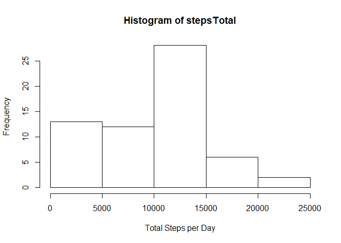
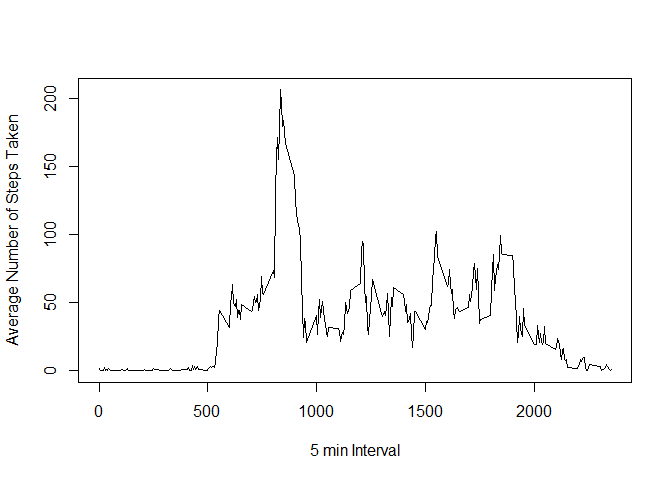
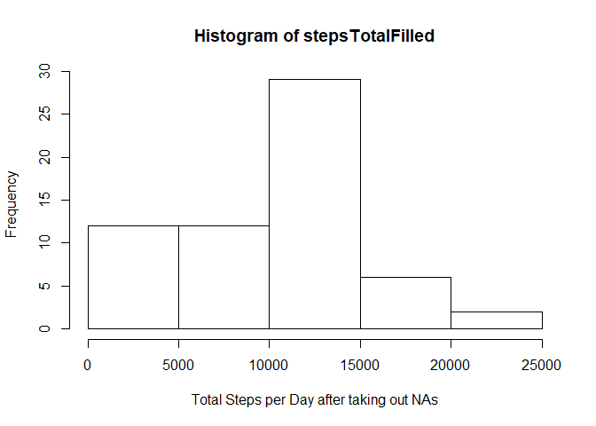
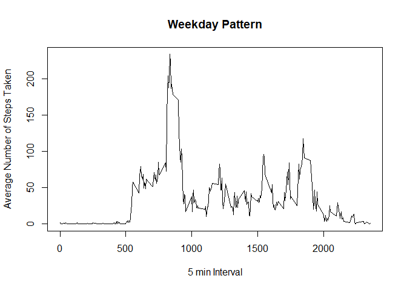
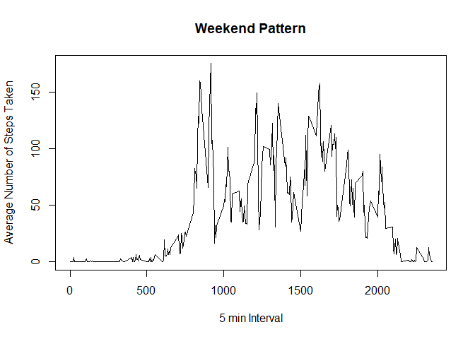

## Loading and preprocessing the data

```r
unzip(zipfile="activity.zip")
activity <- read.csv("activity.csv")
```


## What is mean and median total number of steps taken per day?

```r
stepsTotal <- tapply(activity$steps, activity$date, FUN=sum, na.rm=TRUE)
hist(stepsTotal, xlab = "Total Steps per Day")
```

<!-- -->

```r
mean(stepsTotal, na.rm=TRUE)
```

```
## [1] 9354.23
```

```r
median(stepsTotal, na.rm=TRUE)
```

```
## [1] 10395
```

## What is the average daily activity pattern?

```r
avgSteps <- aggregate(steps ~ interval, data = activity, FUN = mean)
plot(avgSteps, type="l", xlab="5 min Interval", ylab = "Average Number of Steps Taken")
```

<!-- -->

```r
## Which 5 min interval contains the max number of steps?
avgSteps[which.max(avgSteps$steps),]
```

```
##     interval    steps
## 104      835 206.1698
```

## Imputing missing values

```r
## Calculate the number of missing values in the dataset
sum(is.na(activity))
```

```
## [1] 2304
```

```r
## Imputing missing values
activityFilled <- activity
activityFilled$steps[is.na(activityFilled$steps)] <- avgSteps$steps[is.na(activityFilled$steps)]
## Create a histogram and the mean and average values of the filled in data set
stepsTotalFilled <- tapply(activityFilled$steps, activityFilled$date, FUN=sum, na.rm=TRUE)
hist(stepsTotalFilled, xlab = "Total Steps per Day after taking out NAs")
```

<!-- -->

```r
mean(stepsTotalFilled, na.rm=TRUE)
```

```
## [1] 9530.724
```

```r
median(stepsTotalFilled, na.rm=TRUE)
```

```
## [1] 10439
```

## Are there differences in activity patterns between weekdays and weekends?

```r
library(lubridate)
```

```
## 
## Attaching package: 'lubridate'
```

```
## The following object is masked from 'package:base':
## 
##     date
```

```r
activityFilled$date <- ymd(activityFilled$date)
activityFilled$weekday <-  weekdays(activityFilled$date)

## subsetting weekdays
weekday <- subset(activityFilled, weekday == "Monday" | weekday == "Tuesday" | weekday== "Wednesday" | weekday == "Thursday" | weekday== "Friday")

## subsetting weekends
weekend <- subset(activityFilled, weekday =="Saturday" | weekday == "Sunday")

## aggrigating the weekdays
avgStepsWeekday <- aggregate(steps ~ interval, data = weekday, FUN = mean)


## Plotting Weekday pattern
plot(avgStepsWeekday, type="l", xlab="5 min Interval", ylab = "Average Number of Steps Taken", main= "Weekday Pattern")
```

<!-- -->

```r
## Aggrigating and Plotting weekend Pattern
avgStepsWeekend <- aggregate(steps ~ interval, data = weekend, FUN = mean)
plot(avgStepsWeekend, type="l", xlab="5 min Interval", ylab = "Average Number of Steps Taken", main = "Weekend Pattern")
```

<!-- -->

There is an observable difference between the weekday and weekend patterns.
